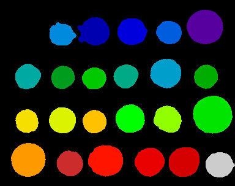
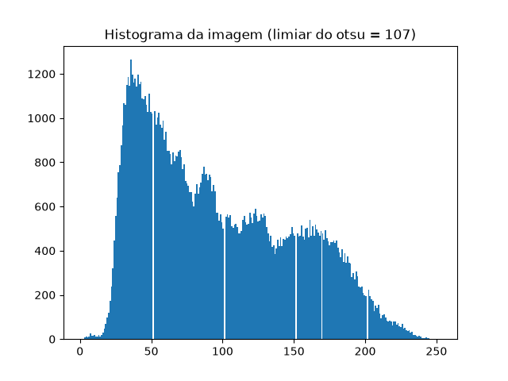
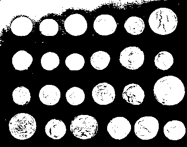
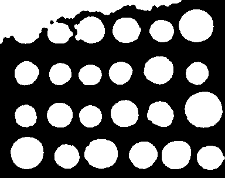
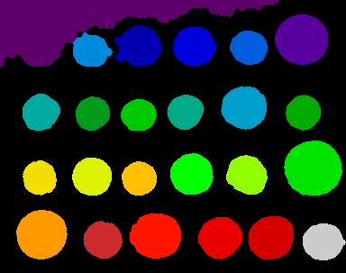

# Prova Técnica — Visão Computacional (TCS Industrial)

Processo seletivo 2025 — área de Visão Computacional.

## Sobre o uso de IA

Utilizei IA como apoio para estudar os conceitos e a sintaxe das bibliotecas antes de escrever cada etapa. As decisões técnicas, os testes e os diagnósticos dos problemas descritos abaixo foram feitos por mim, com base nos resultados que observei rodando o código.

----

## Questão 1 — Detecção e contagem com YOLO

### Abordagem

Utilizei o modelo YOLOv8n (nano), da biblioteca `ultralytics`, pré-treinado no dataset COCO (mais de 200 mil imagens anotadas em 80 classes). A detecção foi feita com confiança (`conf`) de 0.5 e filtrando apenas a classe "car" (índice 2 no COCO).

O pipeline de detecção segue etapas internas da própria biblioteca: a imagem é dividida em uma grade, onde cada célula é responsável por prever caixas candidatas para objetos cujo centro cai dentro dela, junto com um score de confiança e a classe prevista. Em seguida, o IoU (Intersection over Union) é calculado entre as caixas candidatas, e o algoritmo NMS (Non-Maximum Suppression) remove duplicatas, mantendo apenas a caixa de maior confiança para cada objeto.

### Resultado

**3 carros detectados de 3 carros presentes na imagem final**, com confiança média de 0.876.

### Etapas

Antes de escrever qualquer código, estudei a teoria por trás do YOLO: como a divisão em grade funciona, o que é o score de confiança, como o IoU mede sobreposição entre caixas, e como o NMS usa isso para eliminar detecções duplicadas. Também estudei a estrutura do dataset COCO e o papel do parâmetro de confiança mínima na filtragem de detecções fracas.

Com essa base, escrevi o código usando `ultralytics` e testei numa primeira imagem de estacionamento em vista aérea. O resultado foi ruim: apenas 1 carro detectado, apesar de haver muitos mais visíveis na foto, com confiança média de apenas 0.34. Para investigar, rodei o modelo sem filtro de classe e com confiança mínima bem baixa (0.05), o que revelou que o modelo alternava entre classificar os veículos como "car", "truck" e "bus", todas com confiança igualmente baixa, evidência de que, vistos estritamente de cima, esses veículos perdem as pistas visuais (perfil lateral, altura, formato de cabine) que normalmente os diferenciam. Concluí que o modelo provavelmente foi pouco exposto, durante o treinamento no COCO, a fotos de carros fotografados nesse ângulo específico.

Troquei então para uma foto de estacionamento em ângulo oblíquo (nível do chão/elevação moderada), rodando exatamente o mesmo código, sem alterar nenhum parâmetro. O resultado mudou drasticamente: 3 carros detectados corretamente, com confianças individuais de 0.90, 0.87 e 0.86 — uma comparação direta que evidencia o quanto o ângulo da câmera afeta a confiabilidade do modelo.

### Justificativas

**Qual modelo/versão você usou e por quê?**

Utilizei o modelo YOLOv8n (nano), da família YOLOv8 da Ultralytics, pré-treinado no dataset COCO — um conjunto consolidado com mais de 200 mil imagens anotadas em 80 classes, incluindo a classe "carro" usada nesta detecção. Escolhi a versão nano por ser a mais leve e rápida da família, adequada para rodar em CPU comum sem GPU dedicada, o que é suficiente para uma tarefa de teste como esta.

**Como lidou com detecções duplicadas ou de baixa confiança?**

Para baixa confiança, usei o parâmetro `conf=0.25` do `ultralytics`, que descarta qualquer detecção abaixo desse limiar antes mesmo de compará-la com outras. Para duplicadas, a biblioteca aplica automaticamente o algoritmo NMS: ele ordena todas as caixas candidatas de uma mesma classe por confiança, mantém a de maior confiança, calcula o IoU dela contra as demais e descarta qualquer caixa com IoU acima de um limiar (indicando que se trata do mesmo objeto físico). O processo se repete até não sobrar nenhuma caixa duplicada.

Quanto à baixa confiança, encontrei um caso real durante os testes: a primeira imagem que usei era fotografada 100% de cima (vista aérea), e a confiança máxima obtida para "car" foi de apenas 0.34 — muito abaixo do que se obtém em fotos convencionais. Ao investigar com um diagnóstico sem filtro de classe, percebi que o modelo alternava entre "car", "truck" e "bus" para os mesmos objetos, todos com confiança igualmente baixa, sugerindo que o modelo foi pouco exposto a esse ângulo específico durante o treinamento no COCO e perde a capacidade de diferenciar essas classes sem a pista visual do perfil lateral do veículo. Ao trocar para uma foto em ângulo oblíquo, mantendo o mesmo código e os mesmos parâmetros, a confiança média subiu para 0.876, uma evidência direta de que o ângulo da câmera, e não o limiar de confiança em si, era a causa do problema.

**Qual foi o valor de confiança médio das detecções que você contou?**

A confiança média foi de **0.876**, com confianças individuais de 0.90, 0.87 e 0.86 para os três carros detectados.

## Questão 2 — Segmentação com visão tradicional

### Abordagem

Utilizei a imagem de moedas do próprio scikit-image (`skimage.data.coins()`). O pipeline segue quatro etapas: limiarização com o método de Otsu, limpeza com operações morfológicas (abertura e fechamento), separação de moedas encostadas com watershed, e um filtro final por área para remover um artefato que sobreviveu às etapas anteriores.

### Resultado

*23 moedas contadas* na segmentação final, enquanto a imagem tem 24 moedas reais. Todas as limitações para alcançar as 24 moedas observadas por mim estão explicadas abaixo.

### Etapas

**1. Inspeção inicial**
Antes de processar, inspecionei a imagem para confirmar sua estrutura: é uma matriz numpy de 303×384 (linhas × colunas), com valores de 0 a 255 (padrão `uint8`), variando entre 1 e 252 nessa imagem específica. Também olhei a imagem original para entender a distribuição de iluminação antes de segmentar.

**2. Limiarização com Otsu**
Apliquei o método de Otsu, que testa todos os limiares possíveis e escolhe o que melhor separa os pixels em dois grupos (fundo e objeto), com base no histograma da própria imagem. O limiar encontrado foi *107*. Como o método decide olhando só o brilho de cada pixel, isoladamente, uma região do fundo no canto superior esquerdo, mais clara que o restante do fundo, por iluminação não-uniforme, ficou acima do limiar e foi classificada como objeto, virando uma mancha branca na imagem binarizada.

**3. Limpeza morfológica**
Apliquei fechamento e depois abertura, usando `disk(3)` como elemento estruturante. Essas operações percorrem a imagem comparando cada pixel central com sua vizinhança (definida pelo formato do elemento estruturante) e decidem se ele deve mudar de valor. O objetivo era fechar buracos pequenos dentro das moedas e remover ruído, mas a mancha era grande demais (bem maior que o elemento estruturante) o que significa que se eu tentasse modificar o raio eu, querendo ou não, afetaria outras moedas também.

**4. Separação com watershed**
Como a morfologia sozinha não separa objetos encostados nem elimina a mancha, apliquei watershed. O método calcula, para cada pixel de objeto, a distância até a borda mais próxima (transformada de distância), o centro de cada moeda vira o ponto mais "alto" desse relevo, como se fosse um pico. A partir de marcadores nesses centros, o algoritmo "inunda" para fora até que as águas de duas moedas vizinhas se encontrem, e é aí que a fronteira entre elas é desenhada. Para gerar os marcadores, foi necessário reorganizar as coordenadas dos picos encontrados no formato que o numpy espera (listas separadas de índices de linha e de coluna).

Resultado nessa etapa: **25 regiões contadas** — 24 moedas reais + a mancha, que também gerou um pico e foi tratada como um objeto (por isso teve um objeto a mais).

**5. Filtro por área**
Para remover a mancha, medi a área (em pixels) de cada uma das 25 regiões encontradas. A maioria das moedas ficou entre aproximadamente 1100 e 3100 pixels. Duas regiões destoavam claramente: uma com 12 pixels (ruído pontual) e outra com 9668 pixels (a mancha, mais de 6 vezes o tamanho de uma moeda). Descartei as regiões fora de uma faixa de 500 a 5000 pixels, chegando a **23 moedas**. (Imagem que foi enviada para vocês).

### Justificativas

**Por que esse método de limiarização?**
Escolhi o Otsu porque ele calcula o limiar automaticamente a partir do histograma de cada imagem, em vez de depender de um valor fixo escolhido manualmente. Ele testa todos os limiares possíveis e escolhe o que melhor separa os pixels em dois grupos, com base em quão distintos esses grupos ficam entre si.

**O que aconteceria se a iluminação da cena mudasse?**
Testei isso escurecendo a imagem artificialmente (multiplicando os pixels por 0,5). O limiar do Otsu caiu de 107 para 53 — quase exatamente pela metade, o que confirma que o método se readapta ao novo histograma. Porém, o contraste entre moeda e fundo diminuiu, e pequenas variações internas das moedas passaram a cruzar o novo limiar, criando buracos que não existiam antes. A mancha do canto, por ser originalmente muito clara, continuou sendo classificada como objeto mesmo na versão escurecida.

**Cite um caso em que seu método falharia**
Aqui posso citar justamente a falha que encontrei ao longo do desenvolvimente dessa questão, que foi uma região do fundo mais clara que o restante (por reflexo ou iluminação não-uniforme) é classificada como objeto, porque a limiarização decide olhando só o brilho de cada pixel, sem nenhuma noção de posição ou contexto. Esse tipo de erro não é corrigido pela morfologia quando a região afetada é grande, e pode até "contaminar" outras etapas do pipeline (ver abaixo).

### Limitações observadas

O pipeline não chegou a 24/24. Ao investigar, percebi que uma das moedas reais provavelmente ficou fundida com a mancha durante a etapa de fechamento (a dilatação aproximou as bordas das duas regiões o suficiente para uni-las). Como a região resultante ficou grande demais, ela foi descartada inteira pelo filtro de área. Com mais tempo, tentaria resolver isso reduzindo o raio do fechamento ou filtrando a mancha por formato (bordas irregulares) em vez de só por área.

---

## Questão 3 — Tanque com espuma

*A preencher.*
